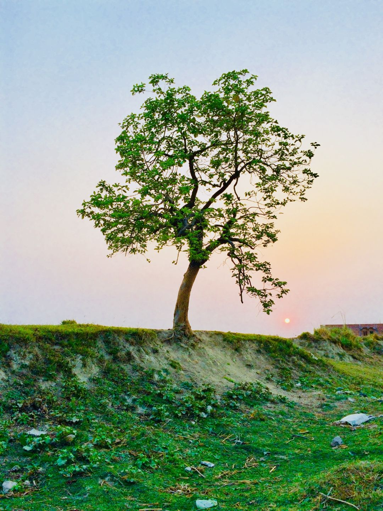
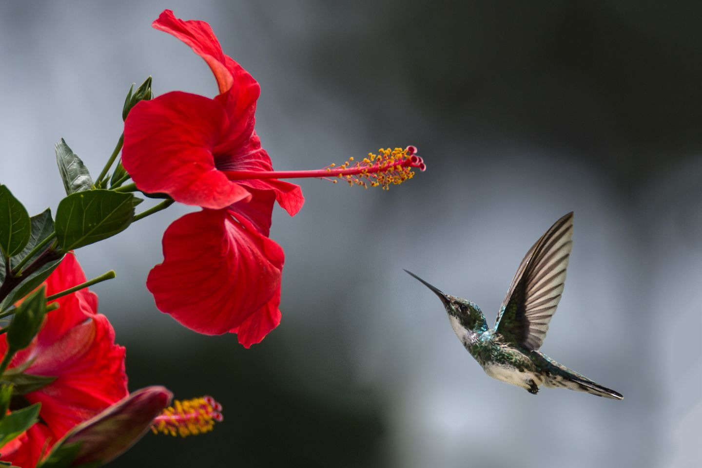
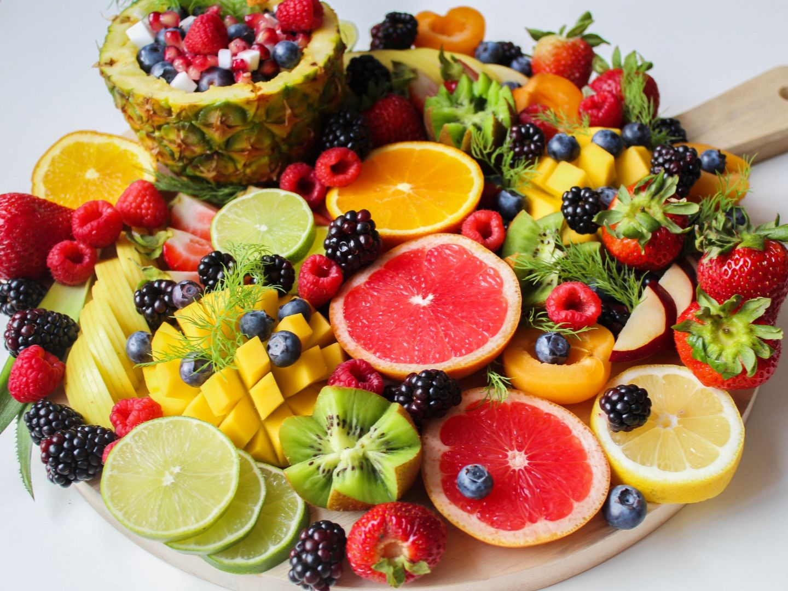

# Desafío 1 - 26/07/2020

Deberás implementar una galería de fotos, utilizando **solamente** HTML y CSS.

## Condiciones del desafío

⛔ No se puede utilizar JavaScript.

⛔ No se puede utilizar ningún framework de CSS.

✅ Resetear los estilos del `margin`, `padding` y `box-sizing`.

✅ La galería de fotos debe estar **centrada horizontal y verticalmente** y tener un ancho de 900px.

✅ La galería debe tener al menos 10 imágenes.

✅ La galería de fotos debe estar **centrada horizontal y verticalmente** y tener un ancho de 900pxge.

✅ Las imágenes deben estar separadas por un margen.

✅ Usar Flexbox (no Grids).

✅ Debe soportar fotos horizontales y verticales.

✅ Debe poder ampliar una foto a su tamaño original o a un máximo determinado al hacerle un click.

✅ Realizar el deploy en [Vercel](https://vercel.com/)

✨ Serás libre de implementar la estética y funcionalidad que quieras, siempre y cuando se cumplan las condiciones esenciales del desafío.

## 📚 Herramientas de consulta

Podrás utilizar cualquier herramienta de búsqueda que necesites (amamos buscar en Google y leer Stack Overflow <3).

## 📸 ¿De dónde saco fotos?

¡Este repositorio incluye algunas fotos de ejemplo! Están en la carpeta [`fotos`](./fotos): 

También podés buscar fotos en [Lorem Picsum](https://picsum.photos/) u otras que te gusten.

## 🤔 ¿Cómo presento mi código?

### Si tenés una cuenta en GitHub

Haciendo un fork de este repo.
